# Equora Wallpapers Collection

A curated collection of wallpapers for the Equora environment.  
Preview each wallpaper below and use them in your setup.

---

## Wallpapers

<details>
<summary>Tahiti eqSh</summary>

### Star Lens


### Purple


### Blue-Chaos


### Solar-Eclipse


### Against-The-Current


### Slick


### Sun-Rays


### Worm-Hole


</details>

<details>
<summary>Other macOS wallpapers</summary>

### Sequoia-Sunrise


### Tea-Day


### Reservoir


### Sonoma


</details>

<details>
<summary>Tahoe</summary>

### Tahoe-City


### Tahoe-Lake


### Tahoe-Dark


### Tahoe-Light


</details>

<details>
<summary>Tilt-Shift / Scenery</summary>

### Tea-Mist


### A-Journey
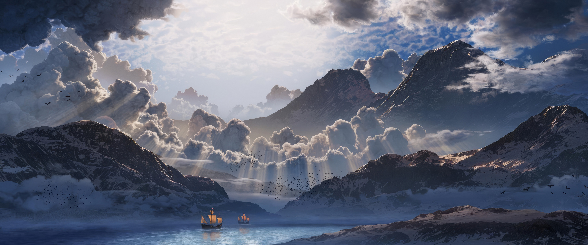

### Bonsai
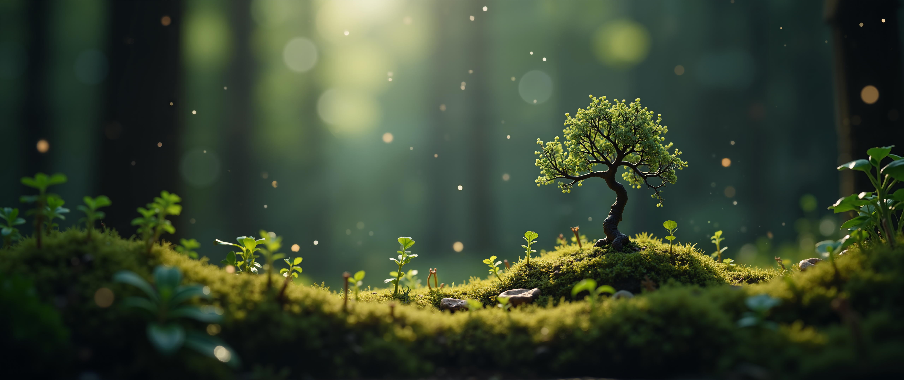

### Macro
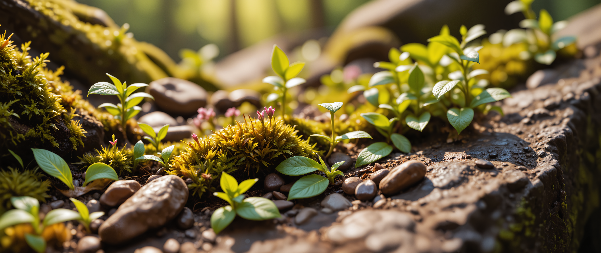

### Rain Leaf
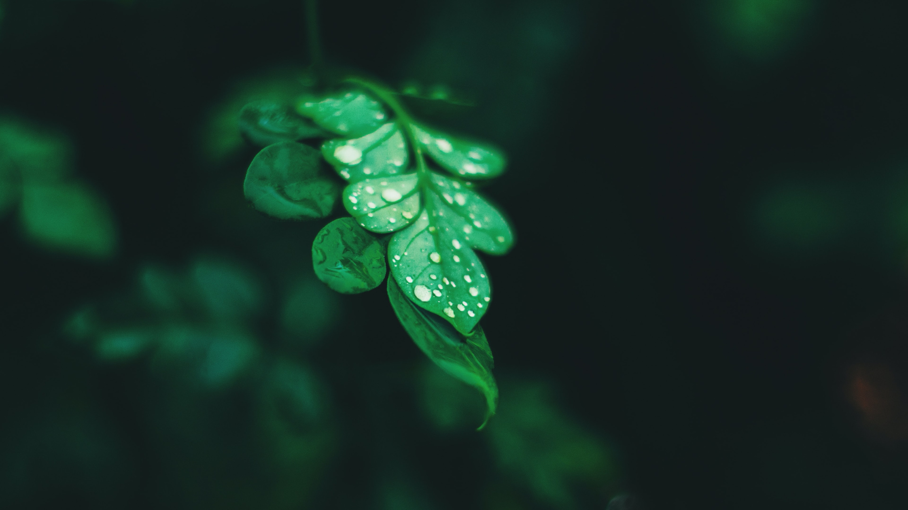

### Mountain
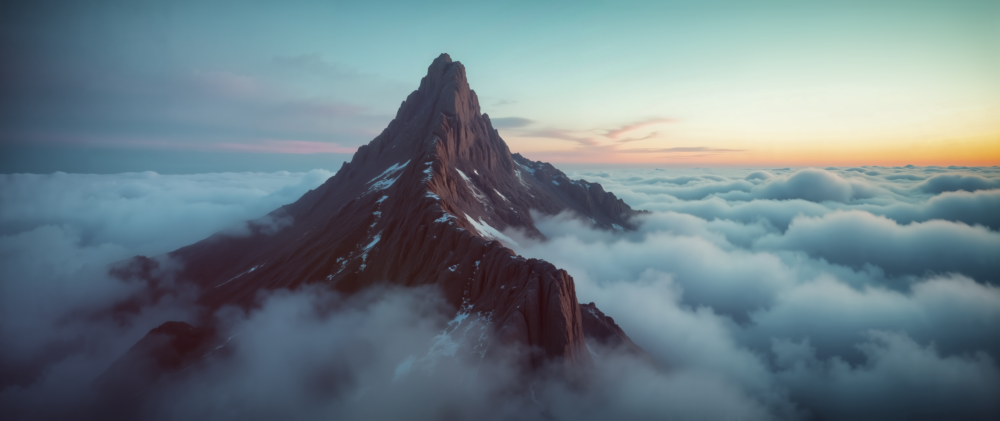

### Skyfall
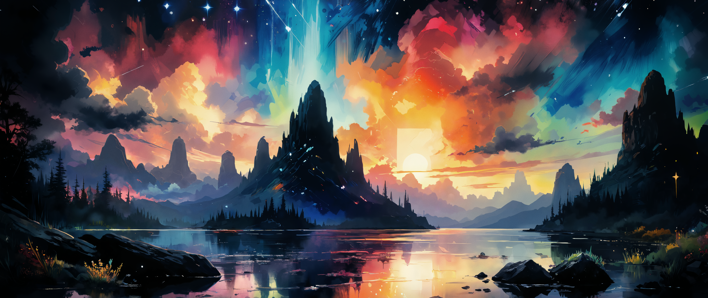

### Village


</details>

<details>
<summary>Abstract</summary>

### Abstract-Clouds


### Cave


### Closed-Sunflower


### Earth


### Glass-Layers


### Golden-Candy


### Red-Moon


### Shaded-Mountain


### Whiskey


</details>

<details>
<summary>Rainworld</summary>

### RainWorldFalling
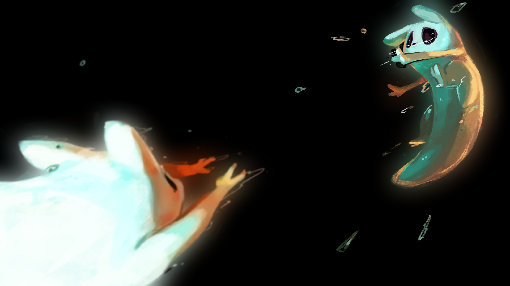

### RainWorldRain
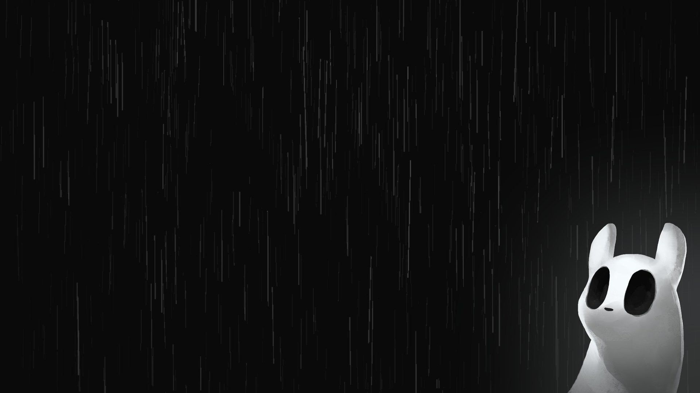

### RainWorldFamily
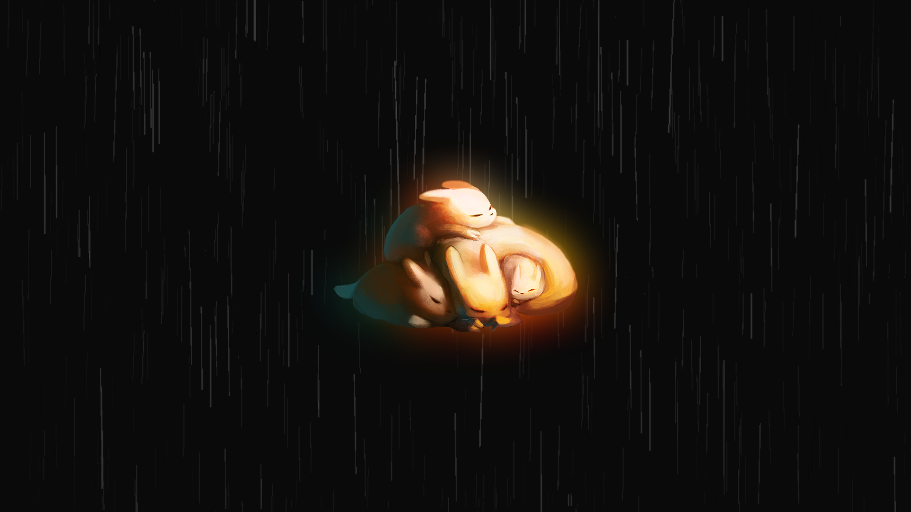

### RainWorldFriend
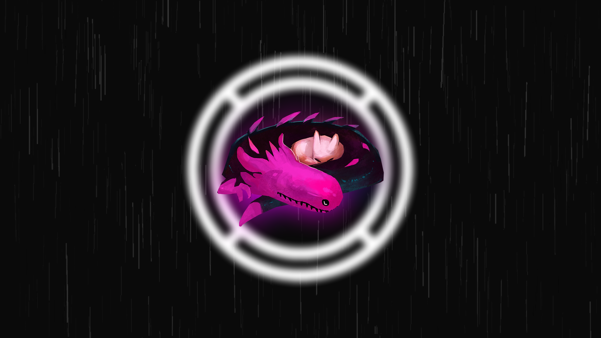

### RainWorldCreature
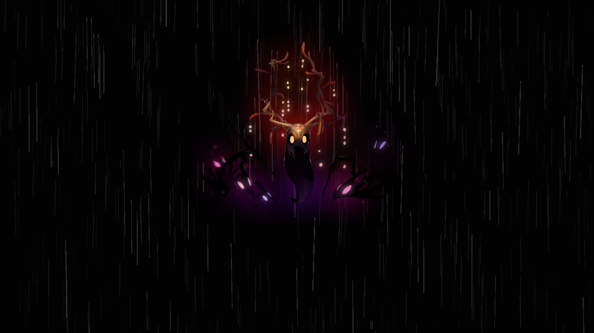

### RainWorldHome
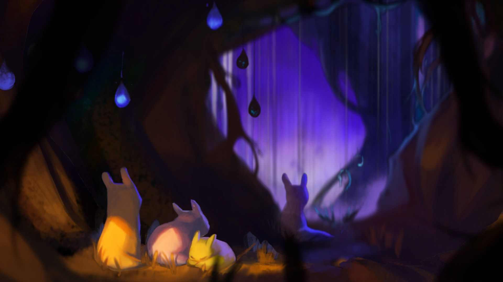

### RainWorldLogo
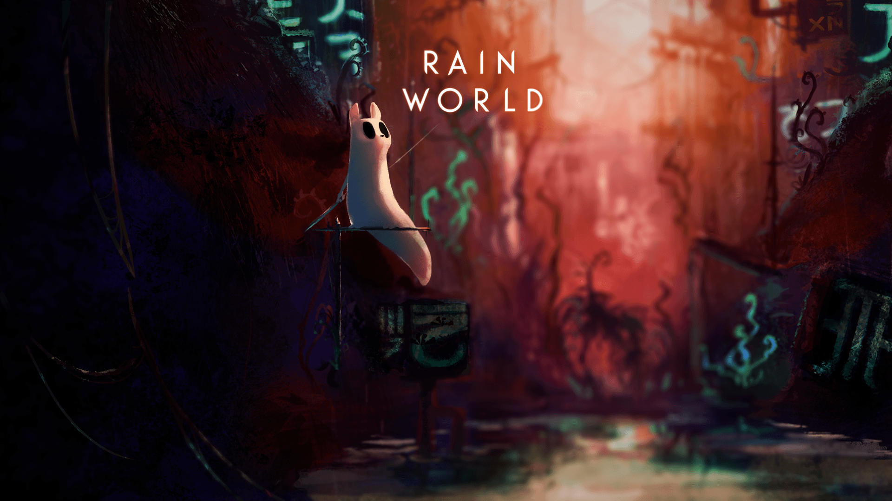

### RainWorldNeon
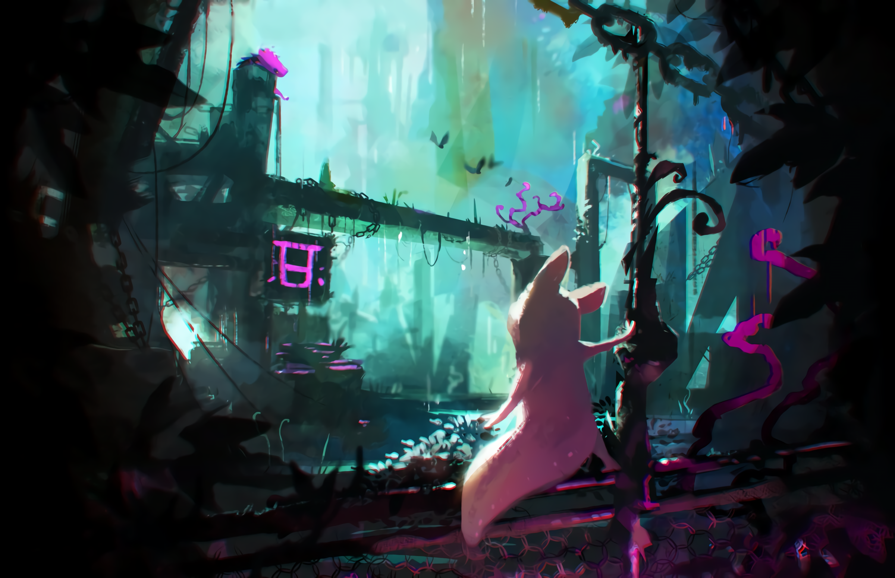
</details>

<details>
<summary>GruvBox</summary>

### Gruv Portal Cake


### Gruv Understand
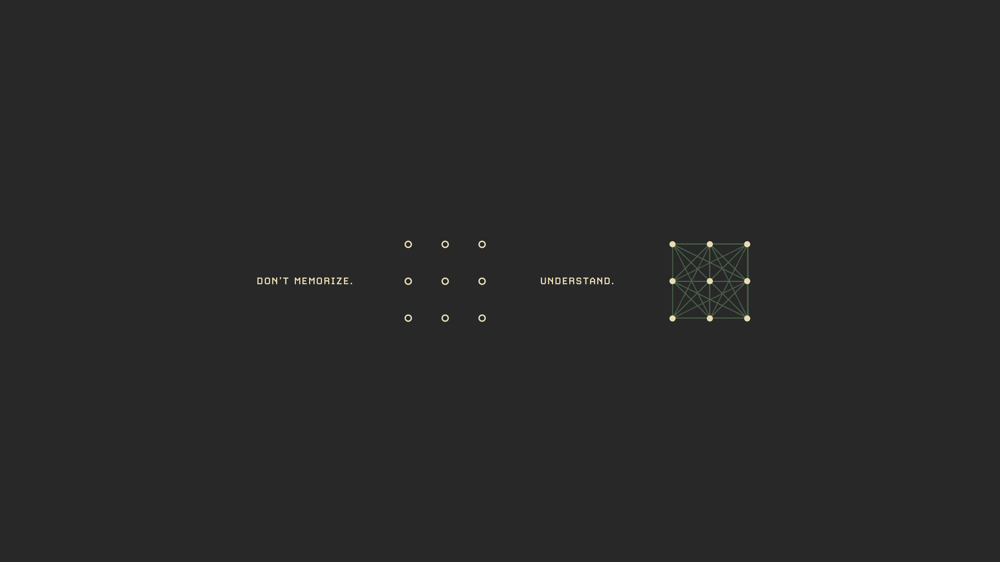

### World Map Dark
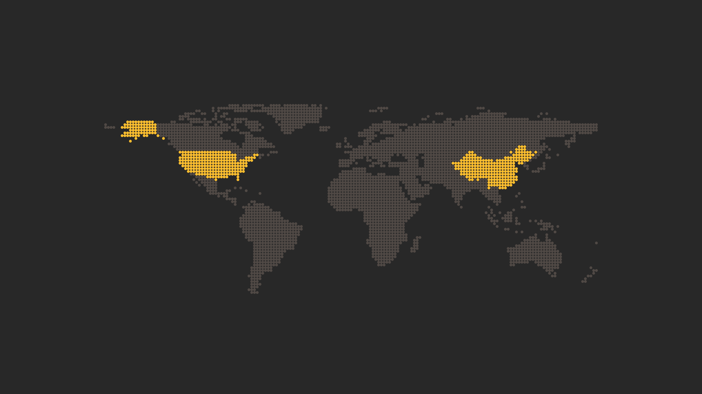

### World Map Light
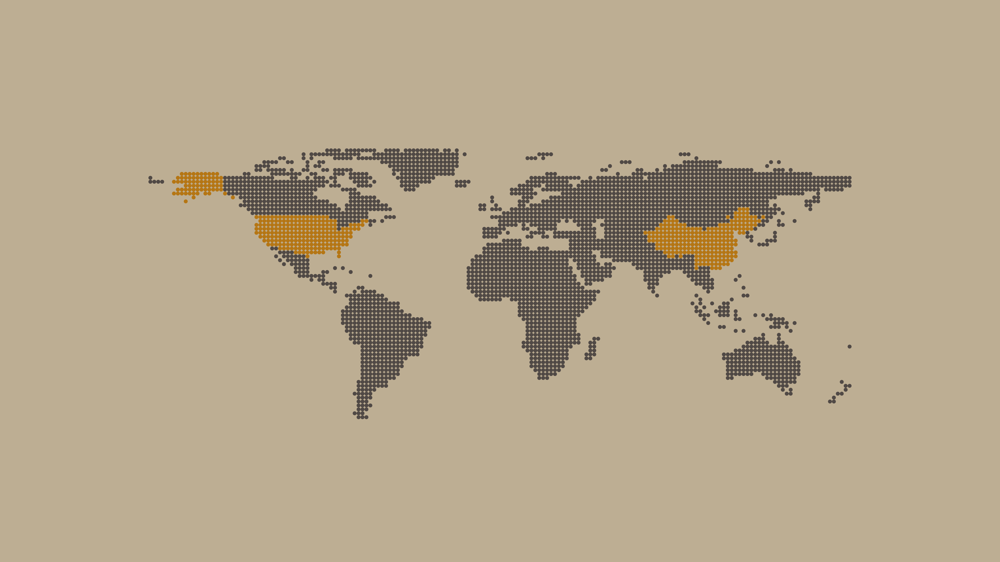

</details>

---

## Usage

Clone the repo into the `~/eqSh/wallpapers` directory.

```bash
git clone https://github.com/eq-desktop/wallpapers ~/eqSh/wallpapers
```